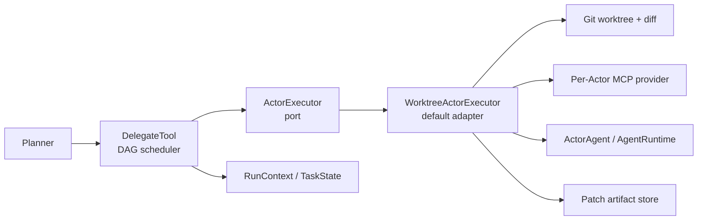
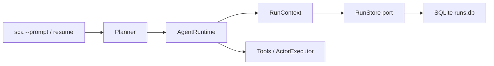

# Simple Coding Agent Architecture

This document describes the runtime boundaries that make Simple Coding Agent auditable: the Planner/Actor lifecycle, worktree isolation, MCP tool boundary, and local eval design.

## Runtime Lifecycle

```text
User prompt
  -> Planner
  -> AgentRuntime
  -> LLM streaming response
  -> tool-call parser
  -> tool executor
  -> AgentEvent stream
  -> CLI renderer / eval trace writer
```

`AgentRuntime` is the shared ReAct loop. Planner and Actor agents both use it, so step limits, tool-call parsing, malformed JSON recovery, repeated-action circuit breaking, context compression, token reporting, and event emission live in one place.

The Planner owns orchestration. Each Planner receives a `RunContext` with an independent task ledger, run ID, event queue, and usage accumulator. It decomposes work, delegates isolated subtasks, receives Actor summaries and diffs, applies selected patches, and synthesizes the final response.

Actors own execution. Each Actor receives one concrete task plus scoped context, runs in its own git worktree, and reports a summary plus an extracted diff. The full extracted diff is persisted as a patch artifact, while compact previews and file lists are sent back through Planner-visible state.

## Delegation Execution Boundary

P1 does not change the external system context or deployment topology. `ActorExecutor` is an in-process port inside the Python Agent container, not a new service. The boundary separates application scheduling from single-Actor infrastructure execution:



`DelegateTool` owns validation, DAG readiness, concurrency, dependency blocking, task-state transitions, exception isolation, and result rendering. It communicates through immutable `ActorTaskSpec` and `ActorExecutionResult` values.

`WorktreeActorExecutor` owns context injection, one-time orphan cleanup, worktree setup, dependency baselines, MCP startup and shutdown, Actor construction, diff extraction, artifact persistence, and worktree cleanup. Context file paths are resolved against both the main workspace and Actor worktree before any pre-MCP read or copy, preventing absolute-path and `..` traversal from bypassing the tool policy.

The default adapter currently reads dependency diffs through `RunContext.state`. This keeps P1 backward compatible, but a future durable or remote executor should receive dependency artifacts through a narrower execution context or directly in the task specification. See [ADR-0001](docs/adr/0001-actor-executor-boundary.md).

## Planner / Actor Flow

1. The Planner receives the user request.
2. For unfamiliar projects, it can delegate a read-only Scout task.
3. For code changes, it creates coder tasks and verifier tasks.
4. `delegate` creates one worktree per Actor.
5. Dependency diffs are applied to dependent Actor worktrees as a committed baseline.
6. The Actor runs with role-specific prompts and an execution-time enforced tool policy.
7. The Actor worktree diff is extracted with `git diff --cached --binary`.
8. The diff is stored under `.sca/artifacts/actor-diffs/`, and the task state records the artifact path plus modified files.
9. The Planner reviews and applies successful diffs to the main workspace.

The dependency baseline matters because verifier tasks must see the coder changes they are validating, while their own final diff should contain only verifier-created artifacts such as tests.

## Worktree Isolation

Each delegated Actor gets a throwaway branch under `.worktrees/`.

This provides:

- filesystem separation from the main workspace
- independent diffs per subtask
- safer concurrent execution
- cleanup after Actor completion
- recovery from abandoned worktrees on startup

The main workspace remains the merge point. `apply_patch` applies selected Actor diffs to the working tree but does not commit automatically, so users can inspect changes before deciding how to version them.

Full Actor patches are also retained under `.sca/artifacts/actor-diffs/`. This gives the Planner a compact context preview without losing the complete artifact needed for audit, retry, and conflict-resolution workflows.

## MCP Tool Boundary

Actor tools are served through MCP providers bound to the Actor worktree:

- filesystem MCP server for file operations
- bash MCP server for shell execution
- local helper tools for code search, outlines, and directory listing

The provider sets the MCP subprocess current working directory to the Actor worktree and performs defense-in-depth path validation for absolute filesystem paths. Actor roles receive different allowlists. The allowlist filters schemas for model guidance and is checked again inside `call_tool()` before local or MCP dispatch, so a directly constructed hidden tool call is denied.

MCP server packages are pinned in `package.json`. At runtime the provider prefers local `node_modules/.bin` executables and falls back to `npx --no-install <package>@<version>`, avoiding unpinned runtime downloads.

Before routing commands to bash MCP, the provider rejects destructive shell patterns such as recursive delete, `git reset --hard`, and `git clean -fd`. These failures are returned as ordinary tool results so the Actor can report the blocked operation instead of mutating the workspace.

A worktree is not an OS sandbox. It isolates branches, diffs, and default working directories, but Actor subprocesses still have the current user's operating-system permissions. The command and path policies are defense-in-depth controls, not a claim of complete process containment.

- Scout: read-only exploration
- Coder: implementation tools
- Verifier: read, test, and test-file creation tools

## Event And Trace Model

The runtime emits `AgentEvent` records for:

- streamed thought/content tokens
- tool calls and tool results
- policy denials
- Actor task updates
- context compaction
- per-call model usage and whole-run token totals
- errors
- final completion

Every event carries a `run_id` plus task/Actor correlation metadata. Planner and nested Actors publish to the same run-scoped queue, so the CLI and eval trace see the full execution tree. Usage prefers provider-reported counts; when a provider omits usage, the locally counted fallback is persisted with `usage_estimated=true`.

The CLI uses this stream for transparent terminal rendering. The eval runner persists the same stream as JSONL at:

```text
tmp/eval-runs/<task_id>/.sca/traces/run_trace.jsonl
```

This makes each run inspectable after the fact without changing the runtime loop.

The Streamlit dashboard reads the same eval artifacts without invoking the agent: `eval_results.json` for aggregate metrics, trace JSONL for the timeline, `.sca/final_report.md` for the run report, and `.sca/artifacts/actor-diffs/*.patch` for Actor diffs. This keeps observability independent from live model access.

## Durable Run Recovery

Non-interactive `--prompt` runs use a `RunStore` port backed by `<workspace>/.sca/runs.db`. The SQLite adapter owns schema setup, WAL configuration, checkpoint JSON encoding, event ordering, and optimistic version checks. `RunContext` owns the current record, full task snapshot, usage totals, and committed root tool-call results.

The root runtime checkpoints only complete message boundaries. Nested Actors share usage and task state but do not overwrite the root conversation checkpoint. On cancellation the run becomes `paused`; `sca resume <run_id>` reconstructs the conversation, task state, usage, and completed-call cache before continuing.



Committed tool-result checkpoints prevent replay of the same root tool-call ID. This is not global exactly-once execution: an external side effect can succeed immediately before a process crash and before SQLite records its result. See [ADR-0002](docs/adr/0002-durable-run-store.md).

## Eval Design

The local eval suite is intentionally deterministic and offline at check time.

`sca-eval run --model <model>` performs the full measurable loop:

1. copy fresh fixture repositories into `tmp/eval-runs/`
2. run the agent against each task prompt
3. write `.sca/final_report.md` in each candidate workspace
4. persist `.sca/traces/run_trace.jsonl`
5. evaluate allowed file changes, required content, forbidden paths, report terms, and pytest results
6. write aggregate `eval_results.json`

`eval_results.json` records pass/fail, duration, tool-call counts, token counts, trace path, report path, final output, and failure reasons per task.

Safety-oriented tasks can seed uncommitted workspace changes before the agent run, assert that forbidden paths such as parent-directory escape targets were not created, and verify that destructive command requests do not remove protected files.

`sca-eval compare` accepts two or more aggregate result files and writes a Markdown comparison report. The first file is treated as the baseline; later runs are compared by pass rate, duration, tool calls, failed tools, token usage, and task-level regressions/improvements.

This keeps the project measurable: changes to prompts, runtime logic, model selection, or tool policy can be compared by pass rate, cost proxy, runtime, and failure mode.
