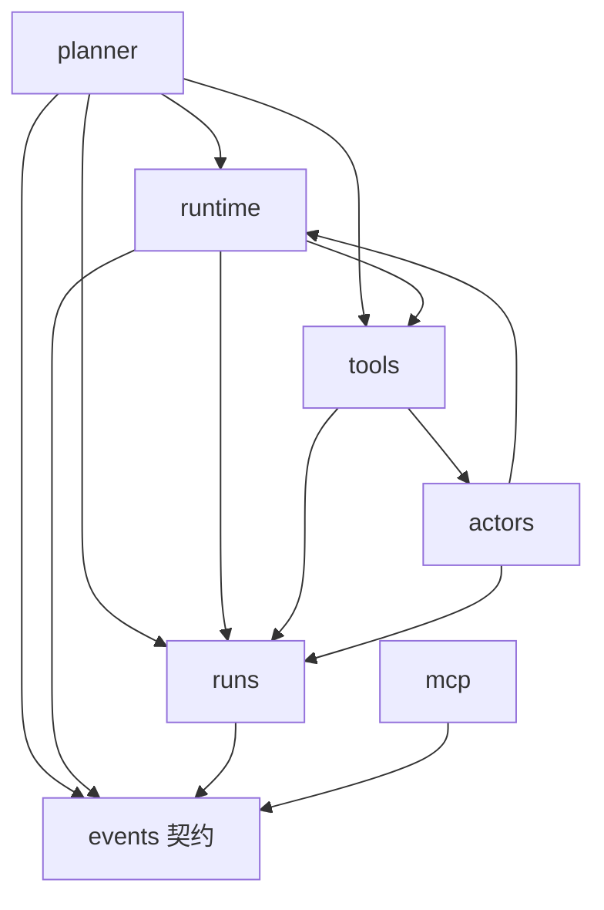
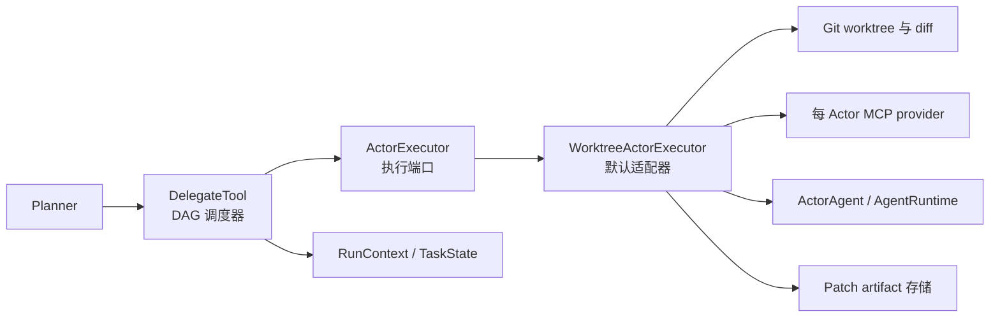
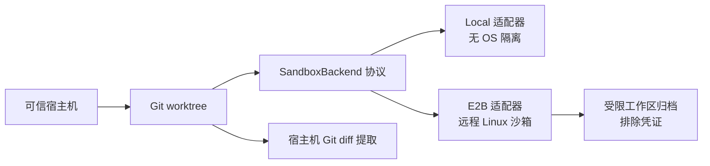
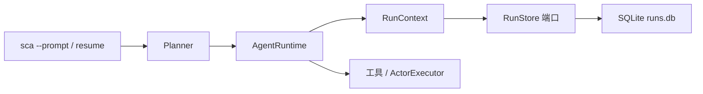

# Simple Coding Agent 架构说明

本文说明 Simple Coding Agent 的几个核心边界：Planner/Actor 生命周期、git worktree 隔离、MCP 工具边界，以及本地 eval 设计。目标是让这个 agent runtime 可审计、可复现、可衡量。

## Core 包边界

模块化单体按高内聚职责组织实现，同时不通过包级大规模 re-export 隐藏依赖：

- `core/runtime/`：ReAct 执行循环与对话压缩。
- `core/runs/`：持久化 Run 模型、任务状态、`RunContext`、存储端口与 SQLite 适配器。
- `core/actors/`：Actor 行为、执行契约、角色配置与 worktree 适配器。
- `core/verification/`：确定性质量门禁配置、子进程执行、证据与修复提示。
- `core/sandbox/`：命令执行端口、本地/E2B 适配器与受控工作区传输。
- `core/events.py`：runtime、runs、MCP、CLI 和 eval 共用的跨域事件契约。
- `core/planner.py`：应用编排入口。
- `core/orchestration/`：框架无关编排端口，以及 legacy / LangGraph 控制平面适配器。



各包的 `__init__.py` 保持最小化。调用方显式导入归属模块，例如 `core.runtime.engine`、`core.runs.context` 或 `core.actors.contracts`，让依赖审查可以直接搜索，并避免 convenience re-export 引发隐式循环。

## Runtime 生命周期

```text
用户请求
  -> Planner
  -> AgentRuntime
  -> LLM 流式响应
  -> tool-call 解析器
  -> 工具执行器
  -> AgentEvent 事件流
  -> CLI 渲染 / eval trace 写入
```

`AgentRuntime` 是共享的 ReAct 执行循环。Planner 和 Actor 都复用它，因此最大步数、工具调用解析、畸形 JSON 恢复、重复动作熔断、上下文压缩、token 统计和事件输出都集中在一处。

CLI、Web Live Agent、eval 和 Harbor 默认使用 LangGraph，在它上方增加粗粒度生命周期：
`assess_task -> compile_policy -> 审批路由/interrupt ->
plan_and_execute_actors -> verification/repair 路由 -> finalize`。Planner、Actor
DAG 和有界 verification repair 继续调用现有组件，不拆成 token/tool 级图节点。
图使用异步 API；本地使用 workspace state 中的 `AsyncSqliteSaver`，测试可使用
`InMemorySaver`。

交互入口通过 `InteractiveOrchestrationSession` 运行。每个用户请求创建新的
durable RunContext/thread，只有有界的用户/助手历史进入下一任务。CLI 在同一
thread 内即时审批恢复，Web Live Agent 提供等价的批准/拒绝控件。

Planner 负责 orchestration：每个 Planner 拥有独立的 `RunContext`，其中包含任务账本、run ID、事件队列和 usage 累计器。Planner 拆解任务、委派隔离子任务、接收 Actor summary 和 diff、应用选中的 patch，并生成最终回复。

Actor 负责 execution：每个 Actor 只接收一个明确子任务，在自己的 git worktree 中运行，最后返回 summary 和提取出的 diff。

## 执行策略与预算边界

`TaskAssessment` 不再只是 prompt 建议。Planner 会将其确定性编译为版本化 `ExecutionPolicy`，并在首个模型调用前安装到 `RunContext`。策略声明 Actor 拓扑、允许角色、是否必须存在质量门禁、是否需要人工批准，以及 Planner/Actor 步数、模型调用、总 token、失败工具调用、修复次数和活跃时长预算。

`RunBudgetLedger` 是 Planner 与所有嵌套 Actor 共享的异步原子账本。模型调用在请求前占用额度，token 在 provider 返回 usage 后记账；若单次响应导致越界，该响应不会再驱动工具执行。委派会在 Actor 启动前原子预留配额，并区分“已启动角色”和“成功完成角色”，避免失败 Scout 放行后续 Coder。`scout_then_coder` 和 `scout_then_dag` 的依赖关系在 `DelegateTool` 内强制校验，而不是依赖模型自觉遵循 prompt。

策略与消费快照会随 `RunCheckpoint` 写入 SQLite。恢复时继续使用原策略和累计消费，进程中断期间的离线时间不计入活跃时长。旧 checkpoint 缺少字段时按 legacy 无新增限制方式加载。交互式 REPL 每轮请求建立新的任务策略范围；持久化非交互 Run 不允许在恢复时重新分类或替换策略，仅允许通过外部 CLI 显式补充高风险批准。

预算越界和策略拒绝采用 fail-closed 语义，分别发出 `budget_exhausted` 和 `policy_denied` 事件。它们不替代角色工具 allowlist、worktree、sandbox、路径边界和破坏性命令检测，而是位于这些防线之上的编排控制层。完整取舍和默认预算见 [执行策略计划](docs/plans/2026-07-15-enforced-execution-policy.md)。

主工作区合并同样受策略保护。`ApplyPatchTool` 会核对任务存在且已完成、执行角色为 Coder、传入 diff 与任务账本中的完整 diff 完全一致；`coder_with_gates` 还要求任务账本记录最终门禁通过。模型无法通过伪造 `task_id` 或自行构造 diff 绕过 Actor/verification 边界。

## 委派执行边界

P1 不改变外部系统上下文或部署拓扑。`ActorExecutor` 是 Python Agent 进程内的端口，不是新的网络服务。这个边界将应用层调度与单个 Actor 的基础设施执行分开：



`DelegateTool` 负责输入校验、DAG 就绪计算、并发控制、依赖失败阻塞、任务状态转换、异常隔离与结果汇总。它通过不可变的 `ActorTaskSpec` 和 `ActorExecutionResult` 与执行端口通信。

`WorktreeActorExecutor` 负责上下文注入、遗留 worktree 清理、worktree 创建、依赖 baseline、MCP 启停、Actor 构造、diff 提取、artifact 持久化与最终清理。上下文文件在 MCP 启动前读取或复制时，会同时校验主工作区和 Actor worktree 的路径边界，阻止绝对路径与 `..` 路径逃逸。

对于 Coder 任务，它同时是确定性验证边界。如果项目存在 `.sca/quality-gates.toml`，门禁命令会以参数数组、无 shell 的方式在 Actor worktree 内顺序执行。必选门禁失败后，结构化证据会回灌给同一个 Actor 上下文进行有界修复，再由 runtime 重新执行门禁，而不是相信 Actor 对“测试已通过”的自然语言声明。相同失败指纹再次出现会提前判定无进展。只有通过全部必选门禁的 Coder diff 才会导出；每轮完整日志保存在用户级 SCA state 目录，紧凑报告随 `ActorExecutionResult` 返回。

默认适配器目前仍通过 `RunContext.state` 读取依赖任务 diff，以保持 P1 向后兼容。未来持久化或远程执行器应使用更窄的执行上下文，或直接从 task spec 接收依赖 artifact。详见 [ADR-0001](docs/adr/0001-actor-executor-boundary.md)。

## A2A_lite 通信契约

`A2A_lite` 是进程内、与传输方式无关的 Agent 通信契约。每个完成或失败的
Actor 都会生成不可变的 `AgentMessage`，当前 schema 为 `a2a-lite/1.0`。
其中 `AgentHandoff` 分别表达 findings、decisions、constraints、未解决问题以及
`ArtifactRef`；patch 引用包含内容摘要，verification 引用保留产出任务和证据位置。

消息会写入任务快照、作为 `a2a_lite_message` 进入 Run 事件流、返回 Planner，
并由 DAG 调度器自动注入已就绪的下游任务。完整 diff 仍保存在用户级 SCA state 目录，
并作为下游 worktree baseline 应用，prompt 只接收结构化 handoff 和 artifact 元数据。
旧的 `context_summaries` 暂时保留兼容，但依赖任务间传递不再要求 Planner 手工复制摘要。

本阶段不引入 broker、网络传输、服务发现、鉴权、ACK 或重试协议。完整决策见
[ADR-0005](docs/adr/0005-a2a-lite-handoffs.md)。

## Planner / Actor 流程

1. Planner 接收用户请求。
2. 如果项目较陌生，可以先委派只读 Scout 任务。
3. 对代码修改任务，Planner 创建 coder task 和 verifier task。
4. `delegate` 为每个 Actor 创建独立 worktree。
5. 如果任务有依赖，上游 diff 会先应用到下游 Actor worktree，并作为 baseline commit。
6. Actor 使用对应角色的 prompt 和在执行入口强制校验的工具策略。
7. Actor worktree 的变更通过 `git diff --cached --binary` 提取。
8. Planner 审阅成功 Actor 的 diff，并应用到主工作区。

依赖 baseline 很关键：Verifier 必须看到 Coder 的改动，才能验证真实代码；但 Verifier 自己导出的 diff 又不应该重复包含 Coder 的改动。

## Worktree 隔离

每个被委派的 Actor 都会获得一个临时分支和独立 Git worktree。干净的 Git
工作区直接使用项目仓库，并在 `.worktrees/` 下创建 Actor worktree。非 Git
目录或包含未提交改动的 Git 工作区会使用进程私有的临时影子仓库。影子仓库
只对当前可见工作区建立一次快照，再从该 baseline 创建标准 Git worktree；
它不会在用户工作区执行 `git init`，也不会写入任何 Git 元数据。

影子快照会排除运行时元数据以及常见依赖和缓存目录，并继续遵循项目的
`.gitignore`。可信宿主机会记录原工作区文件哈希；应用 Actor patch 前只检查
patch 涉及的路径。如果用户在 Actor 执行期间修改了同一文件，合并会 fail
closed，而不是覆盖用户改动。成功合并后会推进对应 baseline 哈希。每个 Actor
结束后立即清理其 worktree，进程正常退出时清理进程持有的影子仓库。

这样可以提供：

- 与主工作区隔离的文件系统视图
- 每个子任务独立的 diff
- 更安全的并发执行
- Actor 完成后的清理
- 启动时清理遗留 worktree 的恢复能力

主工作区只作为最终合并点。`apply_patch` 会把选中的 Actor diff 应用到 working tree，但不会自动 commit，方便用户先审查再决定如何提交。

## MCP 工具边界

Actor 工具通过绑定到 Actor worktree 的 MCP provider 提供：

- filesystem MCP server：文件读写和目录操作
- bash MCP server：shell 执行
- 本地辅助工具：代码搜索、outline、目录列表

provider 会把 MCP 子进程的当前工作目录设置为 Actor worktree，并对绝对路径做额外边界校验。角色 allowlist 既用于过滤模型看到的 schema，也会在 `call_tool()` 内、本地或 MCP 工具真正执行前再次校验，因而直接构造隐藏工具调用也会被拒绝。

- Scout：只读探索
- Coder：实现相关工具
- Verifier：读取、测试、创建测试文件

worktree 不是操作系统沙箱：它隔离分支、diff 和默认工作目录，但 Actor 子进程仍拥有当前用户的系统权限。路径和命令策略属于纵深防御，不代表完整的进程封锁。

## 沙箱执行边界

Git worktree 与 OS 执行隔离是两个可组合的边界。可信宿主机负责 worktree
创建、依赖 baseline、Git 暂存、diff 提取和清理；`SandboxBackend` 负责执行不可信
的 Actor shell 与项目 verification 命令。



E2B 模式不会启动 bash MCP，而是通过前台 `run` 适配器把 shell 字符串交给远程
后端；verification 使用同一后端。宿主机编辑会在命令前上传，远程修改会在命令后
安全回写。SDK、API Key 或传输校验失败会终止 Actor，绝不静默回退到宿主机执行。
完整取舍见 [ADR-0004](docs/adr/0004-sandbox-execution-boundary.md)。

## 事件与 Trace

runtime 会输出 `AgentEvent`，包括：

- 流式 thought/content token
- 工具调用和工具结果
- 工具策略拒绝事件
- Actor 任务状态更新
- 上下文压缩事件
- 单次模型 usage 和整个 Run 的 token 累计值
- 错误
- 最终完成事件

每个事件都携带 `run_id` 和 task/Actor 关联字段。Planner 与嵌套 Actor 发布到同一个 Run 级事件队列，因此 CLI 和 eval trace 能看到完整执行树。token 优先使用 provider 返回值；provider 未返回时，本地估算会明确记录 `usage_estimated=true`。

CLI 使用同一条事件流做终端渲染。eval runner 会把同一条事件流持久化为 JSONL：

```text
tmp/eval-runs/<task_id>/.sca/traces/run_trace.jsonl
```

这样每次运行结束后都能回放和检查 agent 到底做了什么，而不需要改 runtime 主循环。

## 持久化 Run 恢复

非交互 `--prompt` 任务通过 `RunStore` 端口写入用户级 SCA state 目录中按 workspace 隔离的 `runs.db`。最终报告、Actor patch 与 verification 日志使用同一外部根目录，目标工作区只保留 `.sca/quality-gates.toml` 等可选项目配置。SQLite 适配器负责 schema、WAL、checkpoint JSON、事件顺序和乐观版本检查；`RunContext` 持有当前 Run record、完整任务快照、usage 汇总与已落盘的 root tool-call 结果。

State 生命周期由 `core.lifecycle` 独立负责，不进入 Planner/Actor 行为层。
`workspace.json` 记录路径身份、访问时间和 orphan 时间；报告按 run ID 归档，
同时以 `final_report.md` 保持最新视图。GC 保留处于时间窗口内或最新数量窗口内
的 Run，不会按时间清理 active/paused 持久化 Run，并对全局 artifact 执行最旧
优先的容量限制。失联 workspace 会在一次 GC 中先标记 orphan，超过保留窗口后
才可删除。删除 Run 会级联清除 SQLite events、对应历史报告和 run-scoped artifact。

root runtime 只在完整消息边界写 checkpoint。嵌套 Actor 仍共享 usage 和任务状态，但不会覆盖 root 对话 checkpoint。任务被取消时状态转为 `paused`；`sca resume <run_id>` 会先恢复对话、任务树、usage 和已完成调用缓存，再继续执行。



已经提交的 tool-result checkpoint 可以阻止相同 root tool-call ID 被重复执行，但这不是全局 exactly-once：外部副作用可能在成功后、SQLite 落盘前遭遇进程崩溃。完整边界见 [ADR-0002](docs/adr/0002-durable-run-store.md)。

默认 LangGraph 路径中，它的 checkpoint 只负责流程位置、interrupt、pending graph
write 和紧凑 Graph State；`RunStore` 继续负责领域状态、policy/budget、task、
conversation、已完成工具调用、报告、artifact 和审计事件。两者通过相同
run/thread ID 关联。图 checkpoint 和 finalize 未成功前不会向调用方交付成功。

## Eval 设计

评估被拆成两个信任边界不同的层次。本地 fixture suite 是产品回归与安全
smoke suite；它刻意保持小而确定，不应把其分数表述为通用编码能力证明。

外部维护的 coding benchmark 通过 Harbor 运行。Harbor adapter 会上传从当前
checkout 构建的 wheel，在任务容器内创建隔离的 Python 3.12 环境，自动发现任务仓库并
调用 headless `sca-harbor-agent`。Harbor 负责任务准备、外层隔离、隐藏验证、
并发和结果聚合；SCA 在这个已经隔离的环境内使用 local command backend。

adapter 将 SCA 状态写到 `/logs/artifacts/sca`，将 JSONL 事件流写到
`/logs/agent/run-trace.jsonl`，并将可移植汇总写到 `/logs/agent/sca-run.json`。
Harbor 用汇总填充输入/输出 token 和 agent metadata，同时保留原生 final report
与 Actor patches 用于调试。

本地 eval suite 的检查阶段是确定性的、离线的。

`sca-eval run --model <model>` 会执行完整的可衡量流程：

1. 把 fixture 仓库复制到 `tmp/eval-runs/`
2. 对每个 task prompt 调用 agent
3. 在每个候选工作区写入 `.sca/final_report.md`
4. 持久化 `.sca/traces/run_trace.jsonl`
5. 检查允许修改文件、必需内容、报告关键词和 pytest 结果
6. 写入聚合的 `eval_results.json`

`eval_results.json` 会记录每个任务的 pass/fail、耗时、工具调用次数、token 数、trace 路径、report 路径、最终输出和失败原因。

这样项目就具备了可衡量性：prompt、runtime 逻辑、模型选择或工具策略的变化，都可以用通过率、成本代理、耗时和失败模式进行比较。
