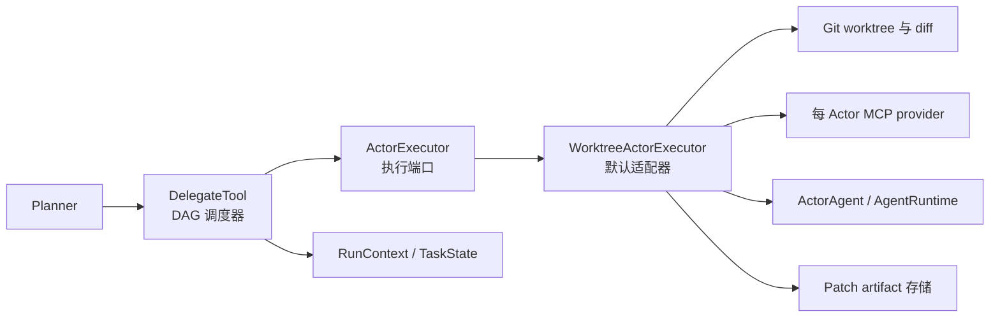
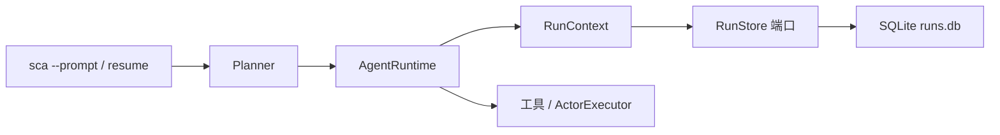

# Simple Coding Agent 架构说明

本文说明 Simple Coding Agent 的几个核心边界：Planner/Actor 生命周期、git worktree 隔离、MCP 工具边界，以及本地 eval 设计。目标是让这个 agent runtime 可审计、可复现、可衡量。

## Runtime 生命周期

```text
用户请求
  -> Planner
  -> AgentRuntime
  -> LLM 流式响应
  -> tool-call 解析器
  -> 工具执行器
  -> AgentEvent 事件流
  -> CLI 渲染 / eval trace 写入
```

`AgentRuntime` 是共享的 ReAct 执行循环。Planner 和 Actor 都复用它，因此最大步数、工具调用解析、畸形 JSON 恢复、重复动作熔断、上下文压缩、token 统计和事件输出都集中在一处。

Planner 负责 orchestration：每个 Planner 拥有独立的 `RunContext`，其中包含任务账本、run ID、事件队列和 usage 累计器。Planner 拆解任务、委派隔离子任务、接收 Actor summary 和 diff、应用选中的 patch，并生成最终回复。

Actor 负责 execution：每个 Actor 只接收一个明确子任务，在自己的 git worktree 中运行，最后返回 summary 和提取出的 diff。

## 委派执行边界

P1 不改变外部系统上下文或部署拓扑。`ActorExecutor` 是 Python Agent 进程内的端口，不是新的网络服务。这个边界将应用层调度与单个 Actor 的基础设施执行分开：



`DelegateTool` 负责输入校验、DAG 就绪计算、并发控制、依赖失败阻塞、任务状态转换、异常隔离与结果汇总。它通过不可变的 `ActorTaskSpec` 和 `ActorExecutionResult` 与执行端口通信。

`WorktreeActorExecutor` 负责上下文注入、遗留 worktree 清理、worktree 创建、依赖 baseline、MCP 启停、Actor 构造、diff 提取、artifact 持久化与最终清理。上下文文件在 MCP 启动前读取或复制时，会同时校验主工作区和 Actor worktree 的路径边界，阻止绝对路径与 `..` 路径逃逸。

默认适配器目前仍通过 `RunContext.state` 读取依赖任务 diff，以保持 P1 向后兼容。未来持久化或远程执行器应使用更窄的执行上下文，或直接从 task spec 接收依赖 artifact。详见 [ADR-0001](docs/adr/0001-actor-executor-boundary.md)。

## Planner / Actor 流程

1. Planner 接收用户请求。
2. 如果项目较陌生，可以先委派只读 Scout 任务。
3. 对代码修改任务，Planner 创建 coder task 和 verifier task。
4. `delegate` 为每个 Actor 创建独立 worktree。
5. 如果任务有依赖，上游 diff 会先应用到下游 Actor worktree，并作为 baseline commit。
6. Actor 使用对应角色的 prompt 和在执行入口强制校验的工具策略。
7. Actor worktree 的变更通过 `git diff --cached --binary` 提取。
8. Planner 审阅成功 Actor 的 diff，并应用到主工作区。

依赖 baseline 很关键：Verifier 必须看到 Coder 的改动，才能验证真实代码；但 Verifier 自己导出的 diff 又不应该重复包含 Coder 的改动。

## Worktree 隔离

每个被委派的 Actor 都会在 `.worktrees/` 下获得一个临时分支和独立 worktree。

这样可以提供：

- 与主工作区隔离的文件系统视图
- 每个子任务独立的 diff
- 更安全的并发执行
- Actor 完成后的清理
- 启动时清理遗留 worktree 的恢复能力

主工作区只作为最终合并点。`apply_patch` 会把选中的 Actor diff 应用到 working tree，但不会自动 commit，方便用户先审查再决定如何提交。

## MCP 工具边界

Actor 工具通过绑定到 Actor worktree 的 MCP provider 提供：

- filesystem MCP server：文件读写和目录操作
- bash MCP server：shell 执行
- 本地辅助工具：代码搜索、outline、目录列表

provider 会把 MCP 子进程的当前工作目录设置为 Actor worktree，并对绝对路径做额外边界校验。角色 allowlist 既用于过滤模型看到的 schema，也会在 `call_tool()` 内、本地或 MCP 工具真正执行前再次校验，因而直接构造隐藏工具调用也会被拒绝。

- Scout：只读探索
- Coder：实现相关工具
- Verifier：读取、测试、创建测试文件

worktree 不是操作系统沙箱：它隔离分支、diff 和默认工作目录，但 Actor 子进程仍拥有当前用户的系统权限。路径和命令策略属于纵深防御，不代表完整的进程封锁。

## 事件与 Trace

runtime 会输出 `AgentEvent`，包括：

- 流式 thought/content token
- 工具调用和工具结果
- 工具策略拒绝事件
- Actor 任务状态更新
- 上下文压缩事件
- 单次模型 usage 和整个 Run 的 token 累计值
- 错误
- 最终完成事件

每个事件都携带 `run_id` 和 task/Actor 关联字段。Planner 与嵌套 Actor 发布到同一个 Run 级事件队列，因此 CLI 和 eval trace 能看到完整执行树。token 优先使用 provider 返回值；provider 未返回时，本地估算会明确记录 `usage_estimated=true`。

CLI 使用同一条事件流做终端渲染。eval runner 会把同一条事件流持久化为 JSONL：

```text
tmp/eval-runs/<task_id>/.sca/traces/run_trace.jsonl
```

这样每次运行结束后都能回放和检查 agent 到底做了什么，而不需要改 runtime 主循环。

## 持久化 Run 恢复

非交互 `--prompt` 任务通过 `RunStore` 端口写入 `<workspace>/.sca/runs.db`。SQLite 适配器负责 schema、WAL、checkpoint JSON、事件顺序和乐观版本检查；`RunContext` 持有当前 Run record、完整任务快照、usage 汇总与已落盘的 root tool-call 结果。

root runtime 只在完整消息边界写 checkpoint。嵌套 Actor 仍共享 usage 和任务状态，但不会覆盖 root 对话 checkpoint。任务被取消时状态转为 `paused`；`sca resume <run_id>` 会先恢复对话、任务树、usage 和已完成调用缓存，再继续执行。



已经提交的 tool-result checkpoint 可以阻止相同 root tool-call ID 被重复执行，但这不是全局 exactly-once：外部副作用可能在成功后、SQLite 落盘前遭遇进程崩溃。完整边界见 [ADR-0002](docs/adr/0002-durable-run-store.md)。

## Eval 设计

本地 eval suite 的检查阶段是确定性的、离线的。

`sca-eval run --model <model>` 会执行完整的可衡量流程：

1. 把 fixture 仓库复制到 `tmp/eval-runs/`
2. 对每个 task prompt 调用 agent
3. 在每个候选工作区写入 `.sca/final_report.md`
4. 持久化 `.sca/traces/run_trace.jsonl`
5. 检查允许修改文件、必需内容、报告关键词和 pytest 结果
6. 写入聚合的 `eval_results.json`

`eval_results.json` 会记录每个任务的 pass/fail、耗时、工具调用次数、token 数、trace 路径、report 路径、最终输出和失败原因。

这样项目就具备了可衡量性：prompt、runtime 逻辑、模型选择或工具策略的变化，都可以用通过率、成本代理、耗时和失败模式进行比较。
