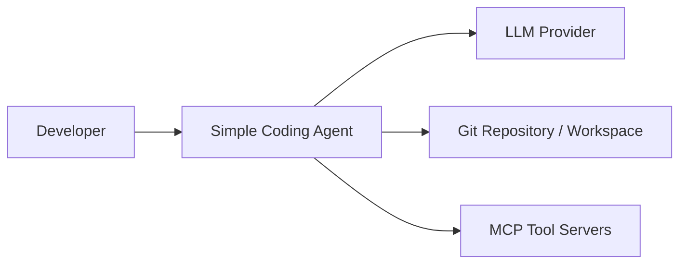
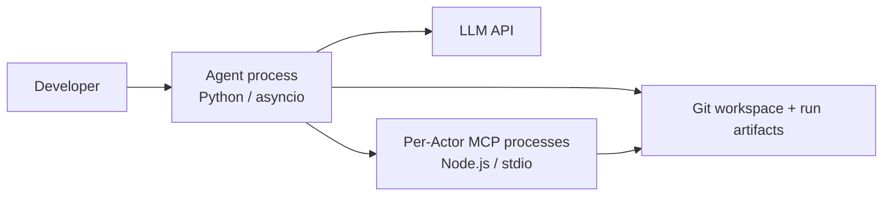
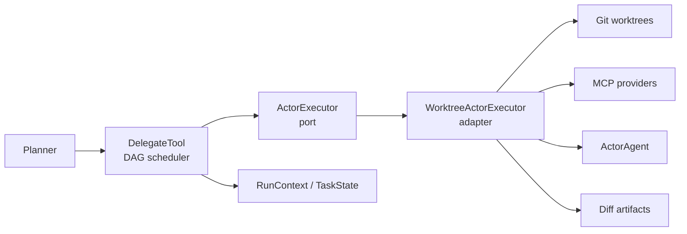

# ADR-0001: Separate Actor Scheduling from Actor Execution

## Status

Accepted on 2026-07-12.

## Context

`DelegateTool` originally combined two different responsibilities:

1. application orchestration: validate tasks, compute DAG readiness, limit concurrency, propagate dependency failures, update task state, and aggregate results;
2. infrastructure execution: build context, create and clean Git worktrees, apply dependency diffs, start and stop MCP providers, construct an Actor, extract its diff, and persist artifacts.

This made scheduler behavior difficult to test without a real Git repository, MCP lifecycle, and model-shaped dependencies. It also coupled future sandbox or remote-executor work to the Planner tool itself.

The change does not alter the system context. Simple Coding Agent still interacts with the same developer, model provider, Git workspace, and MCP tool processes:

The Level 2 container topology is also unchanged. The new port and adapter both live inside the existing Python Agent process:

## Alternatives Considered

### Keep DelegateTool monolithic

This preserves the fewest files and avoids introducing a new abstraction. It was rejected because scheduler tests would continue to require infrastructure monkeypatching, cleanup semantics would remain mixed with DAG logic, and a future Docker or remote executor would require rewriting the orchestration tool.

### Extract helper functions only

Moving worktree and artifact helpers into separate functions reduces file size. It was rejected as the final design because the lifecycle remains implicitly owned by `DelegateTool`; there is still no replaceable execution contract or simple Fake Executor for deterministic scheduler tests.

### Introduce an ActorExecutor port with a Worktree adapter

`ActorExecutor` accepts an immutable `ActorTaskSpec` plus the run scope and returns an immutable `ActorExecutionResult`. `DelegateTool` owns scheduling and state transitions. `WorktreeActorExecutor` owns the complete infrastructure lifecycle for one ready task.

This option was selected because it creates one cohesive replacement boundary without changing public CLI, Planner, event, task-state, or patch behavior.

## Decision

Adopt a ports-and-adapters boundary inside the existing modular monolith:

Ownership is explicit:

- `DelegateTool`: validation, DAG readiness, concurrency, dependency blocking, task-state transitions, exception isolation, and result rendering.
- `ActorExecutor`: stable asynchronous single-task execution contract.
- `WorktreeActorExecutor`: context injection, dependency baseline, worktree/MCP/Actor lifecycle, diff extraction, artifact persistence, and best-effort cleanup.

No service split, database, message broker, or new external dependency is introduced.

## Consequences

### Positive

- DAG behavior is testable with a Fake Executor and no real Git, MCP, or LLM calls.
- Worktree and MCP cleanup have one lifecycle owner.
- A Docker, process sandbox, or remote executor can implement the same port without changing Planner orchestration.
- Immutable task and result value objects make the boundary explicit and type-checkable.

### Negative

- The codebase gains two modules and an additional abstraction that must remain behaviorally stable.
- The default adapter still needs a few factories typed as `Any` because existing MCP and Actor classes do not yet expose narrow protocols.
- `RunContext` currently carries both state and event concerns into the executor boundary; later durable-run work may split those capabilities.
- `DelegateTool` still constructs the default adapter lazily as a compatibility fallback; a later composition-root cleanup should inject it during Planner bootstrap.

### Risks and mitigations

- **Behavior drift during extraction:** existing baseline, runtime, and new fake-executor tests cover dependency diffs, failure propagation, result recording, and cleanup.
- **Pre-MCP context path escape:** the worktree adapter resolves source and destination paths against their workspace roots before reading or copying, with a traversal regression test.
- **Hidden infrastructure leakage back into DelegateTool:** CI mypy scope and architecture tests keep the new modules explicit; code review checks Delegate imports.
- **Multiple executor implementations diverging:** `ActorTaskSpec` and `ActorExecutionResult` are the canonical contract, and conformance tests should be reused by future adapters.
