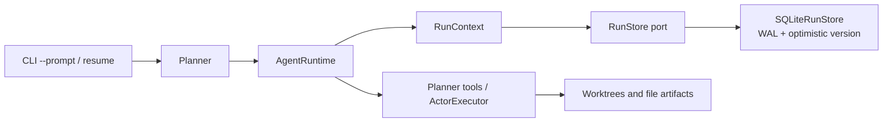

# ADR-0002: Persist Resumable Agent Runs in SQLite

## Status

Accepted on 2026-07-13.

## Context

Planner state, conversation messages, task DAGs, and token usage previously lived only in memory. JSONL traces made completed eval runs auditable, but they were not a transactional recovery source. A process interruption therefore lost the active conversation and could cause a tool call to be repeated when the user retried the task.

The recovery boundary must remain local-first, require no service deployment, support optimistic concurrency, and preserve the existing modular-monolith topology.

## Alternatives Considered

### Keep in-memory state and reconstruct from JSONL traces

This adds no database, but trace records are presentation-oriented, do not contain atomic full checkpoints, and provide no version-checked update primitive. Recovery would depend on replaying partially written events and reconstructing implicit state.

### Store run metadata and checkpoints in SQLite

SQLite provides local transactions, indexes, WAL mode, and optimistic version checks without adding an external service. Complete checkpoints can be replaced atomically while large patch and command-output artifacts remain files referenced by the checkpoint.

### Use PostgreSQL or an external workflow engine

An external database or workflow engine would provide stronger multi-process scheduling primitives, but it would make a local CLI agent harder to install and operate. The current single-host execution model does not justify that deployment cost.

## Decision

Introduce a `RunStore` port and use `SQLiteRunStore` as the default local adapter. The database lives at `<workspace>/.sca/runs.db` and is ignored by Git.



A checkpoint contains the complete root conversation, task-state snapshot, aggregate usage, and completed root tool-call results. Checkpoints are written after complete message boundaries: run start, compaction, assistant tool-call messages, each tool result, completion, failure, and cancellation.

Run records use explicit states:

```text
created -> running -> completed
                   -> paused -> running
                   -> failed -> running
```

Updates require an expected version. A stale writer fails instead of silently replacing a newer checkpoint. Concurrent database initialization retries SQLite lock contention with bounded backoff.

On resume, a completed tool-call ID reuses its persisted observation. If interruption occurred after the assistant tool-call message but before execution, the runtime finishes the missing call before requesting another model response.

## Transaction Boundary

SQLite makes the checkpoint replacement atomic. It cannot make an arbitrary filesystem, shell, network, or MCP side effect atomic with the SQLite commit. A hard crash after an external side effect succeeds but before its tool result is checkpointed may still repeat that side effect. Tool-call caching therefore provides replay protection after a committed tool-result checkpoint, not global exactly-once delivery.

Future high-risk tools should add their own idempotency keys or prepare/commit protocols. The current behavior is intentionally described as checkpoint-boundary idempotency.

## Consequences

### Positive

- Non-interactive CLI tasks can be inspected and resumed after interruption.
- Root tool calls completed before a committed checkpoint are not executed again.
- SQLite remains replaceable through the `RunStore` protocol.
- Run state, messages, task DAG, usage, and event history can be queried without an API key.
- Recovery paths are testable with fake model clients and temporary databases.

### Negative

- Each safe boundary adds a small local database write.
- Checkpoint payload size grows with the retained model context.
- SQLite is appropriate for one local host, not distributed multi-worker scheduling.
- The interactive multi-prompt REPL remains in-memory in P1; durable recovery initially covers `--prompt` runs.

### Risks and Mitigations

- **Stale concurrent writers:** version-checked updates reject them.
- **Corrupt JSON:** loading raises `RunStoreCorruptionError` rather than returning partial state.
- **Database lock during startup:** WAL initialization uses bounded retry and has a concurrent-start regression test.
- **Tool replay window:** the limitation is explicit; completed results are cached only after a durable checkpoint.
