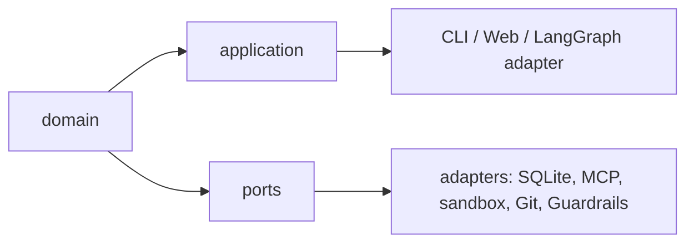

# Dependency Rules

The arrows mean “is used by”. Domain code cannot import adapters, CLI/Web,
LangGraph, MCP, SQLite, Guardrails or sandbox implementations. Ports cannot
import adapters. Application code cannot import `sqlite3`, MCP sessions,
Guardrails third-party types, E2B or subprocess details.

`tests/test_architecture_dependencies.py` enforces framework/import placement
and thin compatibility facades. Runtime tests prove that provider tools and
verification commands enter `ToolGateway` rather than calling transports
directly.

