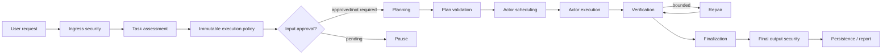

# Architecture Boundary Overview

`AgentWorkflow` is the sole application workflow owner. `ToolGateway` is the
sole application-level tool policy-enforcement point (PEP). `RunAggregate` is
the authoritative live Run state. LangGraph, MCP, SQLite, sandbox backends,
Git, and OpenAI Guardrails are adapters or infrastructure.

| Component | Owns | Must not own |
|---|---|---|
| `AgentWorkflow` | stage transitions, pause/resume, terminal mapping, finalization order | transport, SQL, shell, tool implementations |
| `Planner` | planning, ModelLoop invocation, handoff synthesis, answer draft | Actor DAG and durable Run lifecycle |
| `ModelLoop` | messages, PRE_MODEL, LLM/tool iteration, step/model budget | workflow routing, DAG, SQL, final authorization |
| LangGraph adapter | nodes, cursor, interrupt/checkpointer mapping | policy, authorization, verification semantics |
| Actor executor | one scoped Actor execution through ports | application workflow |
| `ToolGateway` | final-argument authorization and sanitized result | provider session/transport |

Dependency direction is `domain <- application <- interfaces`; ports may use
domain contracts and adapters implement ports. See
[dependency rules](dependency-rules.md).

Security mode behavior:

| Mode | Local content rules | External Guardrails | Failure behavior |
|---|---|---|---|
| `local` | on | off | deterministic rules remain fail closed |
| `hybrid` | on | optional | explicit warning; local decisions remain authoritative |
| `strict` | on | required | missing/error/malformed external result fails closed |
| `off` | content detection off | off | deterministic tool/workspace/approval policy remains on |

Guarantees from middleware are deterministic capability, workspace, command,
network/dependency/Git, and exact-approval decisions. Sandbox backends provide
process/resource isolation only to the degree documented by that backend;
local mode is not OS isolation. Content guards are probabilistic signals and
can only restrict, never widen, deterministic authorization.

Known limitations: the compatibility MCP provider retains path and destructive
command defense-in-depth; local sandbox commands still execute with host-user
authority; worktree isolation is not a network firewall; the LangGraph adapter
still carries bounded orchestration summaries for checkpoint compatibility.

