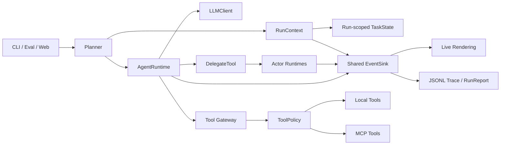

# Runtime Trust Boundary and Observability Design

## Status

Approved on 2026-07-10.

## Objective

Strengthen Simple Coding Agent's production readiness without replacing its existing CLI, MCP integration, or Git worktree execution model. The first milestone adds enforceable tool authorization, run-scoped state, complete Planner/Actor observability, trustworthy usage aggregation, and CI type-checking evidence.

## Scope

This milestone will:

- enforce role tool allowlists at the execution boundary;
- introduce a run-scoped context instead of process-global task state;
- publish Planner and Actor activity through one event sink;
- include Actor tool, error, and token activity in traces and reports;
- distinguish exact provider usage from locally estimated usage;
- add tests and CI checks for the new guarantees.

This milestone will not:

- introduce Docker or an operating-system sandbox;
- replace MCP, Git worktrees, or the public CLI commands;
- add interactive approval for patch application;
- perform a full hexagonal-architecture rewrite;
- require a live model API during CI.

## Alternatives Considered

### Minimal patch

Add an allowlist check inside `MCPToolProvider.call_tool()` and a few Actor counters. This is fast, but leaves duplicated runtime paths, process-global state, and incomplete Actor traces.

### Incremental modularization (selected)

Keep public entry points stable while introducing `RunContext`, `EventSink`, and `ToolPolicy`. Planner and Actor runtimes share the same run context and event destination. This closes the most important trust and audit gaps with a controlled regression surface.

### Full architecture rewrite

Immediately split the project into domain, application, ports, and adapters layers. This offers the cleanest final structure but creates too much short-term migration risk for a working project.

## Architecture

## Components

### RunContext

Each Planner run owns a `RunContext` containing a unique `run_id`, a task-state instance, and the shared event sink. State is injected into Planner tools and delegated Actors. The existing singleton access can remain temporarily as a compatibility shim, but new execution paths must not depend on it.

### ToolPolicy

`ToolPolicy` returns a structured decision with `allow` or `deny`, the tool name, and a human-readable reason. The provider checks this policy immediately before dispatching local or MCP tools. Hiding a schema remains useful for model guidance, but is not treated as authorization.

The decision type reserves room for a later `require_approval` outcome, but interactive approval is outside this milestone.

### EventSink

Planner and all child Actors publish to the same sink. Events carry `run_id`, `task_id`, `actor_id`, and parent correlation metadata with backward-compatible defaults. Existing consumers can continue reading the current fields.

The runtime uses a single internal event-producing path. Convenience `run()` and `run_stream()` interfaces are adapters over that path, preventing behavior drift between streaming and non-streaming execution.

### Usage accounting

The model adapter captures provider-reported usage when available. If the provider does not report usage, it emits a local estimate with `estimated=true`. Run reports aggregate usage across the entire Planner/Actor execution tree.

## Data Flow

1. An interface creates a Planner and a new `RunContext`.
2. Planner runtime publishes model and tool events to the shared sink.
3. DelegateTool creates Actors using the same context identifiers and sink.
4. Actor model calls, tool calls, results, and errors enter the parent run timeline.
5. CLI rendering, JSONL trace writing, and report aggregation consume the same event contract.
6. The final report contains whole-run usage and failure counts rather than Planner-only values.

## Failure Semantics

- Tool authorization is fail-closed. An unknown or disallowed tool returns a failed result and publishes `policy_denied`.
- Actor failures remain isolated from sibling Actors. Existing dependency blocking behavior remains intact.
- Event consumer failures do not crash the agent loop; they produce `sink_error` where delivery remains possible.
- Interactive trace persistence failure produces a visible warning. Eval trace persistence failure makes the eval run fail.
- Missing provider usage falls back to an explicitly marked estimate instead of silently presenting an estimate as exact.

## Compatibility

- `sca`, `sca-eval`, and `sca-web` command names and arguments remain unchanged.
- Existing `AgentEvent` construction remains valid through default metadata values.
- Existing Git worktree and patch-application behavior remains unchanged.
- Existing role prompts and tool schema filtering remain in place as model guidance.

## Testing Strategy

### Authorization

- permitted tools execute successfully;
- a directly constructed call to a hidden tool is denied;
- denial events contain role, tool, and reason;
- destructive-command checks continue to work.

### Run isolation

- two Planners in one process do not share task trees or change logs;
- parallel Actors share a run ID but have distinct actor/task IDs;
- Web project switching no longer depends on resetting global task state.

### Observability and usage

- Actor model, tool, result, and error events appear in the parent trace;
- Planner and Actor token usage is aggregated;
- estimated usage is labeled;
- sibling results remain visible when one Actor fails.

### Engineering gates

- the existing test suite stays green;
- new policy, event, state-isolation, and usage tests pass without a live API key;
- touched production modules pass mypy;
- compile, CLI help, and eval fixture preparation checks pass in CI.

## Acceptance Criteria

The milestone is complete when an offline Fake LLM scenario proves that child Actor events and usage reach the parent run trace, direct calls to unauthorized tools are denied at execution time, two runs have isolated task state, and all automated test and CI checks pass.
